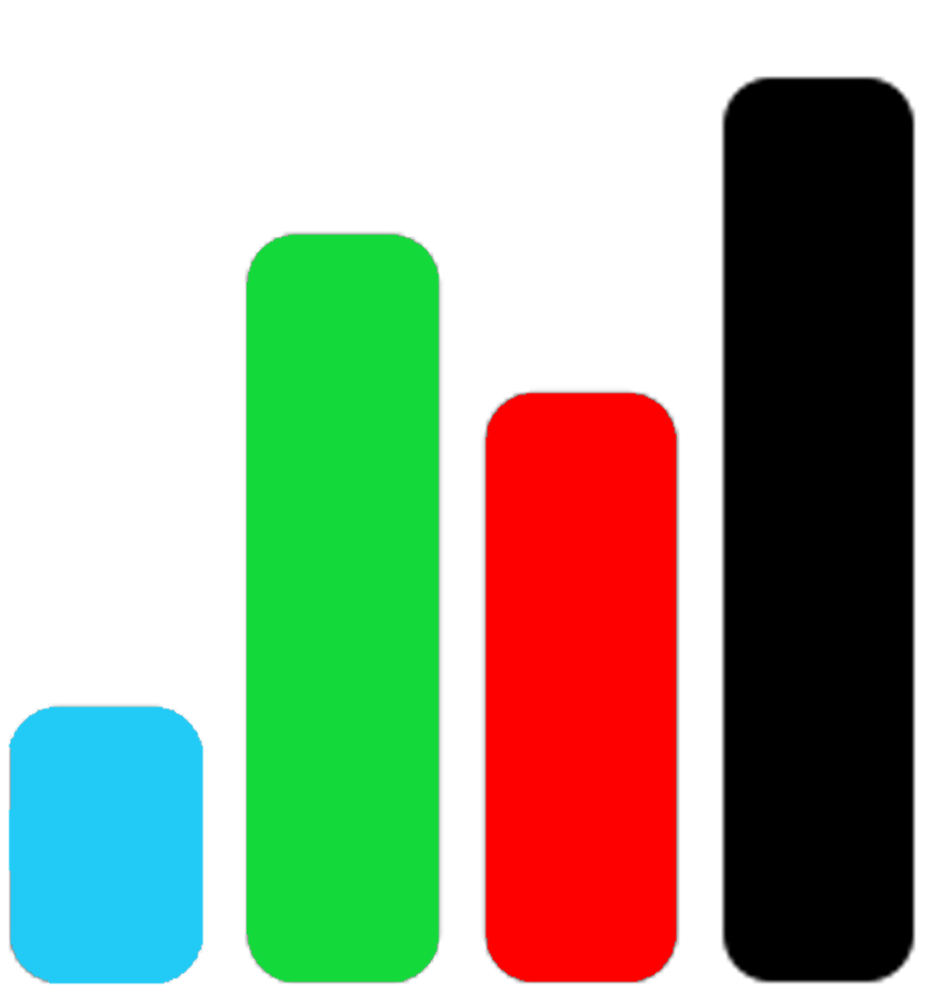

# German Election Map Simulator

<a href="null"></a>

This is a website with interactive maps and data about German politics. This website attempts to inform about the German election system and politics in Germany.

<br/>


## Resources and Links
- [Social Media](null)
- [Functions Guide](FUNCTIONS.md)

## Purpouse
This project was initially created as a school project. My intention with this project was, and still is, to inform people about politics in Germany. Specifically, political geography and voting behaviour.

## Code and Data
**Languages used:** HTML, CSS, JavaScript <br/>
**Libraries used:** d3.js (v6), topojson <br/>
**Data:** Federal Returning Office <br/>

First of all I must mention that much of this was not my own idea. Many the ways in which this website is constructed is based off [principalfish.co.uk](https://principalfish.co.uk/).

The maps are generated from GeoJSON data using topojson and d3.js. 

The JavaScript is structured so that there is one main script file which generates the map and graphs by parsing the data from the `.json` and `.csv` files and then utilises functions defined in other script files to manipulate said data. Most of the file names are self-explanatory; the `functions.js` file is a file for miscellaneous functions used throughout the code.

To run the website yourself for personal purpouses use a localhost as just opening the `index.html` file won't work.

If you wish to edit the code it is best to keep the file structure as is. If you wish to add additional features create a new script file and store the functions within an object in that file (a guide to the functions can be found under the Resources and Links section). If linked to the main html file these can then be used throughout other script files, similar to libraries.

For Example:
```js
var foo = {
  write : function(input) {
    console.log(input);
  }
}
```
*in a separate file which is also linked on the HTML document*
```js
foo.write("Hello World!");
```
*output*
```HTML
Hello World!
```
